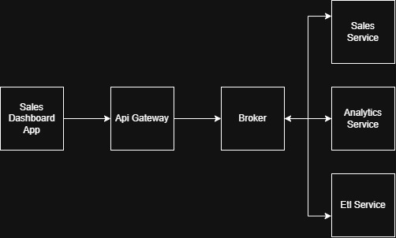
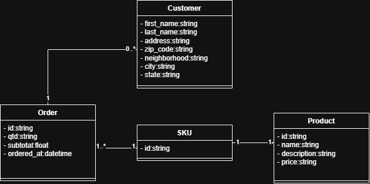

# Sales Insights Hub

- It is a study project to practice data warehouse modeling and the usage of it in an analytics dashboard.

- The idea is to feed a database through a sales endpoint, and then an ETL service is going to make the job of get raw data from this relational database, transform and normalize data, and then save it in data warehouse.

- "Load sample sales data (e.g., orders, customers, products) into a warehouse and build a dashboard showing revenue trends, top products, and regional performance."

## System Architecture

## Class Diagram

